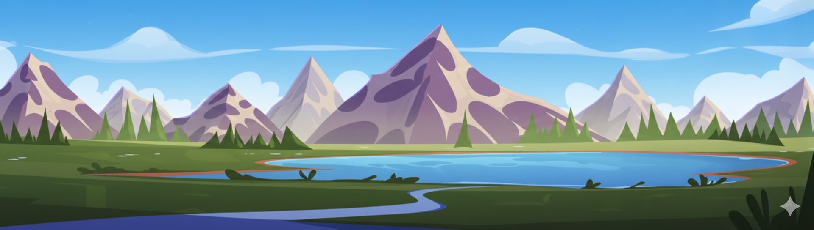

# About Me

- 🛠️ Passionate about applying artificial intelligence to real-world problems  
- 🧠 Research interests include Deep Reinforcement Learning and Edge Computing  
- 🎶 Play the traditional Persian instrument [Setar](https://www.youtube.com/watch?v=cFSQGoL5Ko8)

<picture>
  <source media="(prefers-color-scheme: dark)" srcset="./assets/night.png">
  <source media="(prefers-color-scheme: light)" srcset="./assets/day_light.png">
  
</picture>

<!--
**ahmad-karami/ahmad-karami** is a ✨ _special_ ✨ repository because its `README.md` (this file) appears on your GitHub profile.

Here are some ideas to get you started:

- 🔭 I’m currently working on ...
- 🌱 I’m currently learning ...
- 👯 I’m looking to collaborate on ...
- 🤔 I’m looking for help with ...
- 💬 Ask me about ...
- 📫 How to reach me: ...
- 😄 Pronouns: ...
- ⚡ Fun fact: ...
-->
